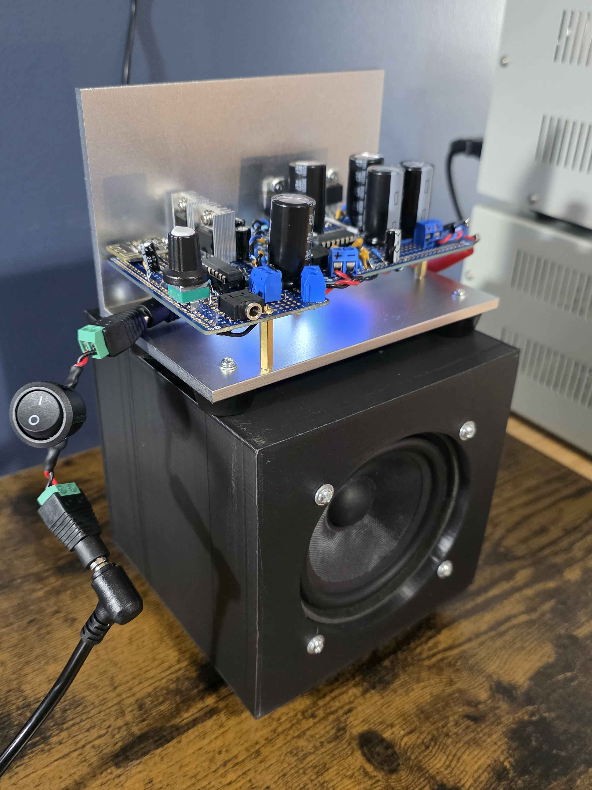
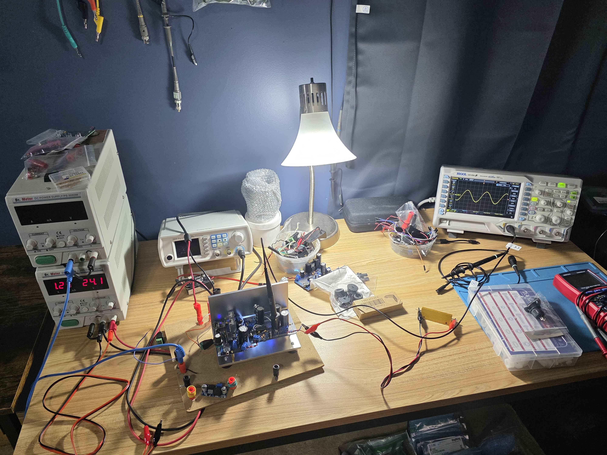
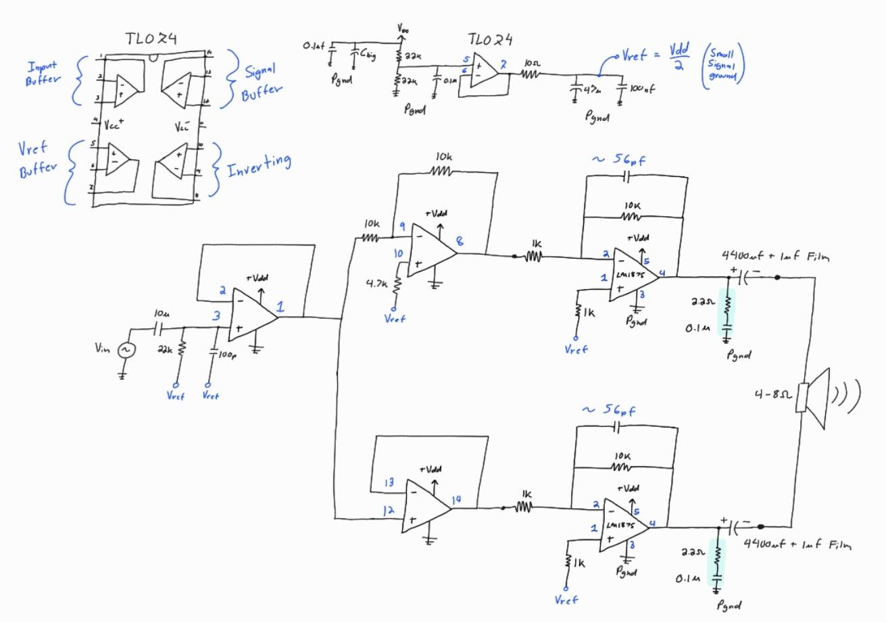
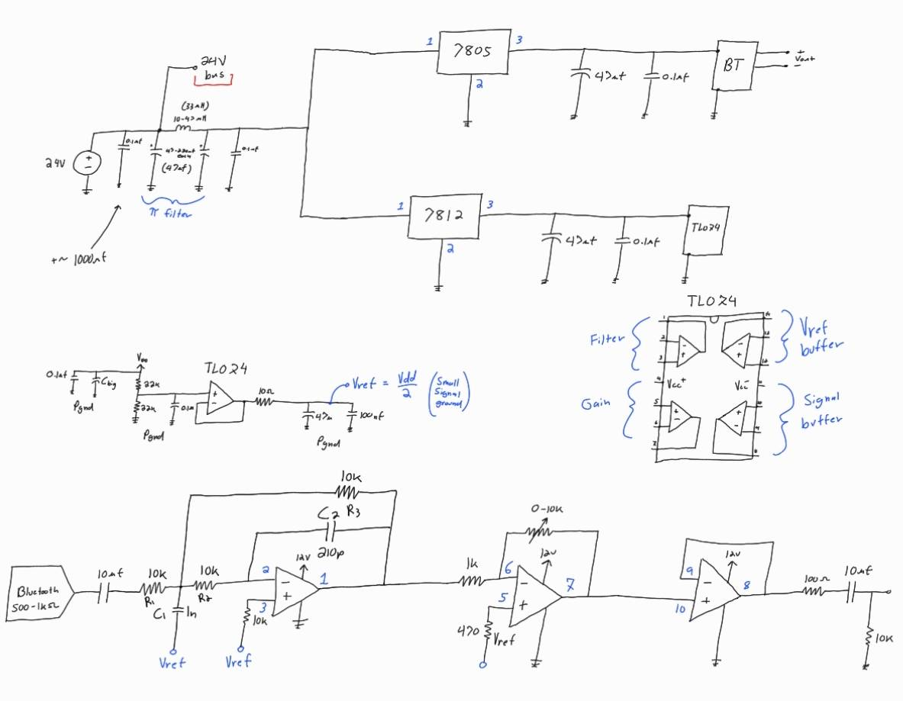

# LM1875
This repository holds the schematics for my LM1875 bridge tied load bluetooth system design

  

  

There are a few purposes to this design:

1- Design a portable analog power stage that can be powered by arbitrary random voltage sources. Right now I am using a $20 24V power supply from Amazon. 

2- See how usable cheap Amazon bluetooth recievers are when they have an appropriate analog front end. The 35khz 2nd order filter does a great job cleaning it up. It does not sound noisy.

3- Verify that my simple BTL design works properly, which it does.

Overall the performance of this system is fantastic. It is also a very simple, robust design. It could be an appropriate first seroius sound system build.
The performance could be significantly improved by using a better signal source, and passive crossovers. It can also be a modular part of an active crossover system.
I suspect the performance would be quite hi-fi with those improvements, however the practical build version has great performance.

For this build I used semiconductors, bulk caps, and capacitors for the zobel network that were sourced from digikey. Components
like connectors, resistors, some ceramic capacitors, etc.... were sourced from Amazon

  

Schematic for the LM1875 power stage. It has a buffered voltage reference, and a buffered phase splitter.
The two power stages are effectively identical, other than their input voltages being inverted. 

  

Schematic for the bluetooth reciever board. The 35khz filter is very important. Without it the signal is very noisy, but the filter
significantly improves it. If your bluetooth reciever draws much more than ~15mA, an SMPS is likely required because 24->5V causes linear regulators to get quite hot with modest current.
This board also uses its own Vref buffer, and has a simple pi filter prior to the regulator stages. 

The Bluetooth Reciever: (I could not find an exact datasheet for the chips)
https://www.amazon.com/hiBCTR-Wireless-Bluetooth-Audio-Receiver/dp/B0FDLGMMYC/ref=sr_1_8?crid=3DKBOKZ5XDMWU&dib=eyJ2IjoiMSJ9.Ey14Xp8PL_cvqfbpIiIjYWXxj94B22gQjrskIaN_9OSuE2tGJMzfQthboqY6oWqdde7jTWCNvS-6AUknTg8yUuXWLyL_c_DhKjeonPEYzKRhL-MK9dDgx2vQOOnEjJAUv90je4o2rh_OWNVmx0x8W2F7p0GuOP16jbI43e3XGTrr47DXw8FddJACRp0f509EWAWG0ARj-SYnOMuHhBSyvtDbCzdWQ3-GAMj4ST7qkKs.GRp5Swsv-R3SbGAuJ1w_j-17IZjX5Rpww4GYMX5TGxs&dib_tag=se&keywords=bluetooth+receiver+module&qid=1774471479&sprefix=bluetooth+receiver+modu%2Caps%2C203&sr=8-8

The Speaker Cone I have been using for testing: (This one sounds pretty good, but it is not ideal)
https://www.amazon.com/PRV-4MR60-4-Midrange-Woofer-Speaker/dp/B00RC3Z9H2/ref=sr_1_6?crid=2IKOZH8NE06QV&dib=eyJ2IjoiMSJ9.XV1eBy6mYGTNdbYa9KJTRsUucknSA-2LjS2FKTUNFO4no8GQunB6z6rkrct99lyID2y6Aa7qPGNoNPIU4-BHwiQzMqgYncaQ_secpVpnuKhVw-5X-MBvs3PMoFNja8961X_r9vzgUbvyGHAEFQI1ByM4JnHZucQ4O2M-fUD_HCycoxnskHtwJPa5tVGxC7PX6H5EzyM5mUZZ88_DYoDybu7Ry47flU3YiQ7P1TFDE14.R1Oh0-YXqKZUCSp3BBkY7Y87WD7bE8cbGDKj9U-p9RA&dib_tag=se&keywords=4+ohm+output+driver&qid=1774472286&sprefix=4+ohm+output+driv%2Caps%2C147&sr=8-6
